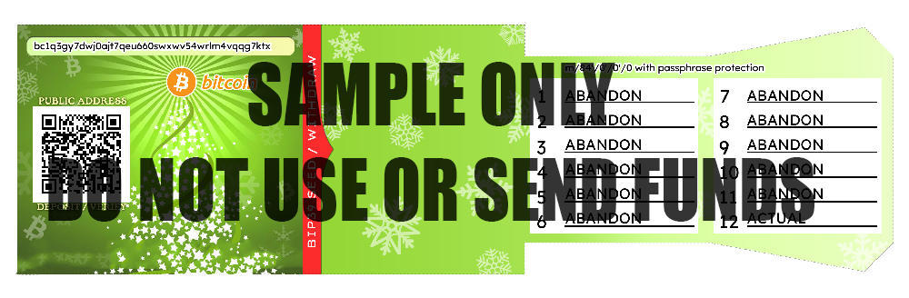

# Cryptocurrency Paper Wallet Generator

Inspired by [cantonbecker/bitcoinpaperwallet's](https://github.com/cantonbecker/bitcoinpaperwallet) paper wallet generator but brought into the new era with BIP32+BIP43 support via [bip_utils](https://github.com/ebellocchia/bip_utils).



As of writing this only bitcoin using BIP84 standard with holiday template is supported. The script takes a single parameter, the number of wallets you want to create with random seeds.

If 0 is passed in, then it creates a single test wallet.

### Getting Set Up

#### Windows OS

Clone repo:
```
git clone https://github.com/eccentricbiped/crypto-pwgenerator.git
cd crypto-pwgenerator
```

Activate virtualenv and installing package requirements:
```
py -m venv env
.\env\Scripts\activate
pip install -r requirements.txt
```

### Modifying environment configuration

**Rename the TEMPLATE.env to .env** and configure the properties for your environment.

```
PAPER_WALLET_FRONT_PNG="./template/holiday_paper_wallet_front.png"
PASSPHRASE=""
FILEBASE_PNG="./deploy/png/holiday_pw_"
FILEBASE_PDF="./deploy/pdf/holiday_pw_"
IMGFONT="%LOCALAPPDATA%\Microsoft\Windows\Fonts\LexendDeca-Regular.ttf"
BIP32_BIP43_PATH="m/84'/0'/0'/0"
TEST_ENTROPY_BYTES="00000000000000000000000000000001"
```

### Using the Script Examples

To generate a test wallet, pass 0
```
python PWGenerator.py 0
```

Generating 5 random seed generated wallets
```
python PWGenerator.py 5
```
